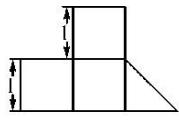
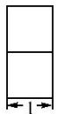

<!-- question-source:start -->
9. 一个几何体按比例绘制的三视图如图所示(单位: m)，则该几何体的体积为(A)

  
正视图

  
侧视图

  
俯视图

A. $\frac{7}{2}\mathrm{m}^3$ B. $\frac{9}{2}\mathrm{m}^3$ C. $\frac{7}{3}\mathrm{m}^3$ D. $\frac{9}{4}\mathrm{m}^3$
<!-- question-source:end -->

![[高中/总复习/专题/立体几何/专题01 关于3视图还原几何体的深度剖析与秒杀-立体几何（文理通用）/专题01_关于3视图还原几何体的深度剖析与秒杀_立体几何_文理通用_/对点训练/answers/Q00039482A1.md]]
