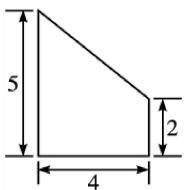
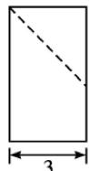
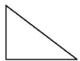

<!-- question-source:start -->
8. (2014 重庆)某几何体的三视图如图所示，则该几何体的体积为( ).

  
正视图

  
左视图  
俯视图

A. 12 B. 18 C. 24 D. 30
<!-- question-source:end -->

![[高中/总复习/专题/立体几何/专题01 关于3视图还原几何体的深度剖析与秒杀-立体几何（文理通用）/专题01_关于3视图还原几何体的深度剖析与秒杀_立体几何_文理通用_/对点训练/answers/Q00039494A1.md]]
