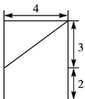
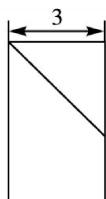
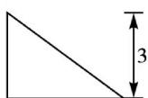

<!-- question-source:start -->
9. (2013 浙江)若某几何体的三视图(单位: cm)如图所示, 则此几何体的体积等于 $\mathrm{cm}^{3}$ .

  
正视图

  
侧视图

  
俯视图
<!-- question-source:end -->

![[高中/总复习/专题/立体几何/专题01 关于3视图还原几何体的深度剖析与秒杀-立体几何（文理通用）/专题01_关于3视图还原几何体的深度剖析与秒杀_立体几何_文理通用_/对点训练/answers/Q00039495A1.md]]
