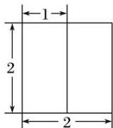
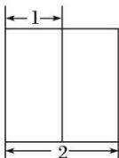
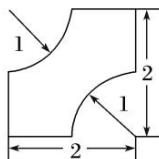

<!-- question-source:start -->
10. (2014 辽宁)某几何体的三视图如图所示, 该几何体的体积为( )

  
正(主)视图

  
侧(左)视图

  
俯视图

A. $8 - 2\pi$ B. $8 - \pi$ C. $8 - \frac{\pi}{2}$ D. $8 - \frac{\pi}{4}$
<!-- question-source:end -->

![[高中/总复习/专题/立体几何/专题01 关于3视图还原几何体的深度剖析与秒杀-立体几何（文理通用）/专题01_关于3视图还原几何体的深度剖析与秒杀_立体几何_文理通用_/对点训练/answers/Q00039496A1.md]]
