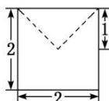
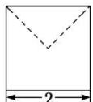
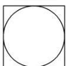

<!-- question-source:start -->
13. 某几何体的三视图如图所示, 则该几何体的表面积是( )

  
正视图

  
侧视图

  
俯视图

A. $20 + \sqrt{2}\pi$ B. $24 + (\sqrt{2} -1)\pi$ C. $24 + (2 - \sqrt{2})\pi$ D. $20 + (\sqrt{2} +1)\pi$
<!-- question-source:end -->

![[高中/总复习/专题/立体几何/专题01 关于3视图还原几何体的深度剖析与秒杀-立体几何（文理通用）/专题01_关于3视图还原几何体的深度剖析与秒杀_立体几何_文理通用_/对点训练/answers/Q00039499A1.md]]
