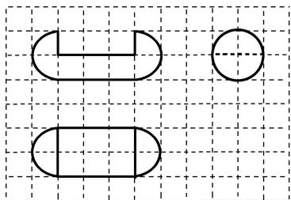

<!-- question-source:start -->
14. 如图, 网格纸上小正方形的边长为 1 , 粗线画出的是某几何体的三视图, 则该几何体的表面积为( )

A. $5\pi + 18$ B. $6\pi + 18$ C. $8\pi + 6$ D. $10\pi + 6$
<!-- question-source:end -->

![[高中/总复习/专题/立体几何/专题01 关于3视图还原几何体的深度剖析与秒杀-立体几何（文理通用）/专题01_关于3视图还原几何体的深度剖析与秒杀_立体几何_文理通用_/对点训练/answers/Q00039500A1.md]]
