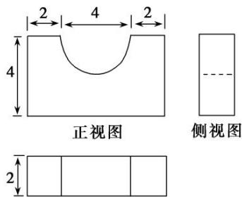

<!-- question-source:start -->
15. 已知某几何体的三视图如图，其中正视图中半圆直径为 4，则该几何体的体积为 \_\_\_\_.

  
俯视图
<!-- question-source:end -->

![[高中/总复习/专题/立体几何/专题01 关于3视图还原几何体的深度剖析与秒杀-立体几何（文理通用）/专题01_关于3视图还原几何体的深度剖析与秒杀_立体几何_文理通用_/对点训练/answers/Q00039501A1.md]]
