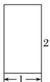
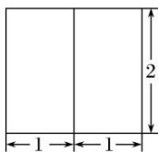
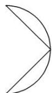

<!-- question-source:start -->
16. 某几何体的三视图如图所示, 其中俯视图右侧曲线为半圆弧, 则几何体的表面积为( )

  
正视图

  
侧视图

  
俯视图

A. $3\pi + 4\sqrt{2} - 2$ B. $3\pi + 2\sqrt{2} - 2$ C. $\frac{3\pi}{2} + 2\sqrt{2} - 2$ D. $\frac{3\pi}{2} + 2\sqrt{2} + 2$
<!-- question-source:end -->

![[高中/总复习/专题/立体几何/专题01 关于3视图还原几何体的深度剖析与秒杀-立体几何（文理通用）/专题01_关于3视图还原几何体的深度剖析与秒杀_立体几何_文理通用_/对点训练/answers/Q00039502A1.md]]
