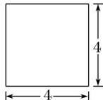
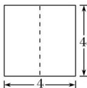
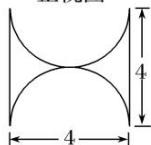

<!-- question-source:start -->
18. 某几何体的三视图如图所示，则该几何体的表面积为( )

  
正视图

  
侧视图  
俯视图

A. $8(\pi +4)$ B. $8(\pi +8)$ C. $16(\pi +4)$ D. $16(\pi +8)$
<!-- question-source:end -->

![[高中/总复习/专题/立体几何/专题01 关于3视图还原几何体的深度剖析与秒杀-立体几何（文理通用）/专题01_关于3视图还原几何体的深度剖析与秒杀_立体几何_文理通用_/对点训练/answers/Q00039504A1.md]]
