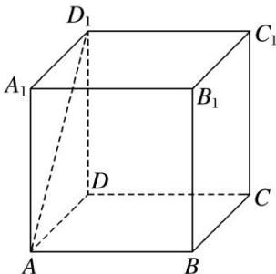

> [!faq]- 《专题02 空间线面位置关系判定1》例题解析
>
> > [!success]- **【答案】** A
>
> > [!note]- **【解析】**
> > 答案 A 解析 若直线 $a \perp$ 平面 $\beta$ , 直线 $a //$ 平面 $\alpha$ , 可得平面 $\alpha \perp$ 平面 $\beta$ ; 若平面 $\alpha \perp$ 平面 $\beta$ , 又直线 $a \parallel$ 平面 $\alpha$ , 那么直线 $a \perp$ 平面 $\beta$ 不一定成立. 如正方体 $ABCD—A_1B_1C_1D_1$ 中, 平面 $ABCD \perp$ 平面 $BCC_1B_1$ , 直线 $AD \parallel$ 平面 $BCC_1B_1$ , 但直线 $AD \subset$ 平面 $ABCD$ ; 直线 $AD_1 \parallel$ 平面 $BCC_1B_1$ , 但直线 $AD_1$ 与平面 $ABCD$ 不垂直. 综上, “直线 $a \perp$ 平面 $\beta$ ”是“平面 $\alpha \perp$ 平面 $\beta$ ”的充分不必要条件.
> >
> > 
