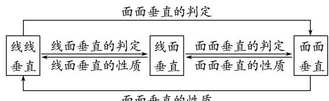

<!-- source-part:1 pages:1-11 -->

## 专题02 立体几何中空间线、面位置关系的判定
(1)

## 1. 直线、平面平行的判定及其性质

(1)线面平行的判定定理： $a \notin \alpha,\quad b \subset \alpha,\quad a \parallel b \Rightarrow a \parallel \alpha.$

(2)线面平行的性质定理： $a \parallel \alpha, a \subset \beta, \alpha \cap \beta = b \Rightarrow a \parallel b.$

(3)面面平行的判定定理： $a \subset \beta$ ， $b \subset \beta$ ， $a \cap b = P$ ， $a \parallel \alpha$ ， $b \parallel \alpha \Rightarrow \alpha \parallel \beta$ .

(4)面面平行的性质定理： $\alpha//\beta,\quad\alpha\cap\gamma=a,\quad\beta\cap\gamma=b\Rightarrow a//b.$

平行问题的转化

  
面面平行的性质

利用线线平行、线面平行、面面平行的相互转化解决平行关系的判定问题时，一般遵循从“低维”到“高维”的转化，即从“线线平行”到“线面平行”，再到“面面平行”；而应用性质定理时，其顺序正好相反。在实际的解题过程中，判定定理和性质定理一般要相互结合，灵活运用。

平行关系的基础是线线平行，证明线线平行常用的方法：一是利用平行公理，即证两直线同时和第三条直线平行；二是利用平行四边形进行平行转换：三是利用三角形的中位线定理证线线平行；四是利用线段的比例关系证明线线平行；五是利用线面平行、面面平行的性质定理进行平行转换。

## 2. 直线、平面垂直的判定及其性质

(1)线面垂直的判定定理： $m \subset \alpha$ ， $n \subset \alpha$ ， $m \cap n = P$ ， $l \perp m$ ， $l \perp n \Rightarrow l \perp \alpha$ .

(2)线面垂直的性质定理： $a \perp \alpha$ ， $b \perp \alpha \Rightarrow a // b$ .

(3)面面垂直的判定定理： $a \subset \beta,\quad a \perp \alpha \Rightarrow \alpha \perp \beta.$

(4)面面垂直的性质定理： $\alpha\perp\beta,\quad\alpha\cap\beta=l,\quad a\subset\alpha,\quad a\perp l\Rightarrow a\perp\beta.$

垂直问题的转化

  
面面垂直的性质

在空间垂直关系中，线面垂直是核心，已知线面垂直，既可为证明线线垂直提供依据，又可为利用判定定理证明面面垂直作好铺垫。应用面面垂直的性质定理时，一般需作辅助线，基本作法是过其中一个平面内一点作交线的垂线，从而把面面垂直问题转化为线面垂直问题，进而可转化为线线垂直问题。

垂直关系的基础是线线垂直，证明线线垂直常用的方法：一是利用等腰三角形底边中线即高线的性质；二是利用勾股定理；三是利用线面垂直的性质：即要证两线垂直，只需证明一线垂直于另一线所在的平面即可， $l \perp a, a \subset a \Rightarrow l \perp a.$

# 立体几何中空间线、面位置关系的判定
(1)

【方法总结】

判断与空间位置关系有关命题真假的方法

(1)借助空间线面平行、面面平行、线面垂直、面面垂直的判定定理和性质定理进行判断.

(2)借助空间几何模型，如从长方体模型、四面体模型等模型中观察线面位置关系，结合有关定理，进行肯定或否定.

(3)借助于反证法，当从正面入手较难时，可利用反证法，推出与题设或公认的结论相矛盾的命题，进而作出判断.

【例题选讲】

[例 1]
![[高中/总复习/专题/立体几何/专题02 立体几何中空间线、面位置关系的判定(1)-立体几何（文理通用）/专题02_立体几何中空间线_面位置关系的判定_1_/例题/Q00043499.md]]
![[高中/总复习/专题/立体几何/专题02 立体几何中空间线、面位置关系的判定(1)-立体几何（文理通用）/专题02_立体几何中空间线_面位置关系的判定_1_/例题/Q00043500.md]]
![[高中/总复习/专题/立体几何/专题02 立体几何中空间线、面位置关系的判定(1)-立体几何（文理通用）/专题02_立体几何中空间线_面位置关系的判定_1_/例题/Q00043501.md]]
![[高中/总复习/专题/立体几何/专题02 立体几何中空间线、面位置关系的判定(1)-立体几何（文理通用）/专题02_立体几何中空间线_面位置关系的判定_1_/例题/Q00043502.md]]
![[高中/总复习/专题/立体几何/专题02 立体几何中空间线、面位置关系的判定(1)-立体几何（文理通用）/专题02_立体几何中空间线_面位置关系的判定_1_/例题/Q00043503.md]]
![[高中/总复习/专题/立体几何/专题02 立体几何中空间线、面位置关系的判定(1)-立体几何（文理通用）/专题02_立体几何中空间线_面位置关系的判定_1_/例题/Q00043504.md]]
![[高中/总复习/专题/立体几何/专题02 立体几何中空间线、面位置关系的判定(1)-立体几何（文理通用）/专题02_立体几何中空间线_面位置关系的判定_1_/例题/Q00043505.md]]
![[高中/总复习/专题/立体几何/专题02 立体几何中空间线、面位置关系的判定(1)-立体几何（文理通用）/专题02_立体几何中空间线_面位置关系的判定_1_/例题/Q00043506.md]]
![[高中/总复习/专题/立体几何/专题02 立体几何中空间线、面位置关系的判定(1)-立体几何（文理通用）/专题02_立体几何中空间线_面位置关系的判定_1_/例题/Q00043507.md]]
![[高中/总复习/专题/立体几何/专题02 立体几何中空间线、面位置关系的判定(1)-立体几何（文理通用）/专题02_立体几何中空间线_面位置关系的判定_1_/例题/Q00043508.md]]
![[高中/总复习/专题/立体几何/专题02 立体几何中空间线、面位置关系的判定(1)-立体几何（文理通用）/专题02_立体几何中空间线_面位置关系的判定_1_/对点训练/Q00039506.md]]
![[高中/总复习/专题/立体几何/专题02 立体几何中空间线、面位置关系的判定(1)-立体几何（文理通用）/专题02_立体几何中空间线_面位置关系的判定_1_/对点训练/Q00039507.md]]
![[高中/总复习/专题/立体几何/专题02 立体几何中空间线、面位置关系的判定(1)-立体几何（文理通用）/专题02_立体几何中空间线_面位置关系的判定_1_/对点训练/Q00039508.md]]
![[高中/总复习/专题/立体几何/专题02 立体几何中空间线、面位置关系的判定(1)-立体几何（文理通用）/专题02_立体几何中空间线_面位置关系的判定_1_/对点训练/Q00039509.md]]
![[高中/总复习/专题/立体几何/专题02 立体几何中空间线、面位置关系的判定(1)-立体几何（文理通用）/专题02_立体几何中空间线_面位置关系的判定_1_/对点训练/Q00039510.md]]
![[高中/总复习/专题/立体几何/专题02 立体几何中空间线、面位置关系的判定(1)-立体几何（文理通用）/专题02_立体几何中空间线_面位置关系的判定_1_/对点训练/Q00039511.md]]
![[高中/总复习/专题/立体几何/专题02 立体几何中空间线、面位置关系的判定(1)-立体几何（文理通用）/专题02_立体几何中空间线_面位置关系的判定_1_/对点训练/Q00039512.md]]
![[高中/总复习/专题/立体几何/专题02 立体几何中空间线、面位置关系的判定(1)-立体几何（文理通用）/专题02_立体几何中空间线_面位置关系的判定_1_/对点训练/Q00039513.md]]
![[高中/总复习/专题/立体几何/专题02 立体几何中空间线、面位置关系的判定(1)-立体几何（文理通用）/专题02_立体几何中空间线_面位置关系的判定_1_/对点训练/Q00039514.md]]
![[高中/总复习/专题/立体几何/专题02 立体几何中空间线、面位置关系的判定(1)-立体几何（文理通用）/专题02_立体几何中空间线_面位置关系的判定_1_/对点训练/Q00039515.md]]
![[高中/总复习/专题/立体几何/专题02 立体几何中空间线、面位置关系的判定(1)-立体几何（文理通用）/专题02_立体几何中空间线_面位置关系的判定_1_/对点训练/Q00039516.md]]
![[高中/总复习/专题/立体几何/专题02 立体几何中空间线、面位置关系的判定(1)-立体几何（文理通用）/专题02_立体几何中空间线_面位置关系的判定_1_/对点训练/Q00039517.md]]
![[高中/总复习/专题/立体几何/专题02 立体几何中空间线、面位置关系的判定(1)-立体几何（文理通用）/专题02_立体几何中空间线_面位置关系的判定_1_/对点训练/Q00039518.md]]
![[高中/总复习/专题/立体几何/专题02 立体几何中空间线、面位置关系的判定(1)-立体几何（文理通用）/专题02_立体几何中空间线_面位置关系的判定_1_/对点训练/Q00039519.md]]
![[高中/总复习/专题/立体几何/专题02 立体几何中空间线、面位置关系的判定(1)-立体几何（文理通用）/专题02_立体几何中空间线_面位置关系的判定_1_/对点训练/Q00039520.md]]
![[高中/总复习/专题/立体几何/专题02 立体几何中空间线、面位置关系的判定(1)-立体几何（文理通用）/专题02_立体几何中空间线_面位置关系的判定_1_/对点训练/Q00039521.md]]
![[高中/总复习/专题/立体几何/专题02 立体几何中空间线、面位置关系的判定(1)-立体几何（文理通用）/专题02_立体几何中空间线_面位置关系的判定_1_/对点训练/Q00039522.md]]
![[高中/总复习/专题/立体几何/专题02 立体几何中空间线、面位置关系的判定(1)-立体几何（文理通用）/专题02_立体几何中空间线_面位置关系的判定_1_/对点训练/Q00039523.md]]
![[高中/总复习/专题/立体几何/专题02 立体几何中空间线、面位置关系的判定(1)-立体几何（文理通用）/专题02_立体几何中空间线_面位置关系的判定_1_/对点训练/Q00039524.md]]
![[高中/总复习/专题/立体几何/专题02 立体几何中空间线、面位置关系的判定(1)-立体几何（文理通用）/专题02_立体几何中空间线_面位置关系的判定_1_/对点训练/Q00039525.md]]
![[高中/总复习/专题/立体几何/专题02 立体几何中空间线、面位置关系的判定(1)-立体几何（文理通用）/专题02_立体几何中空间线_面位置关系的判定_1_/对点训练/Q00039526.md]]
![[高中/总复习/专题/立体几何/专题02 立体几何中空间线、面位置关系的判定(1)-立体几何（文理通用）/专题02_立体几何中空间线_面位置关系的判定_1_/对点训练/Q00039527.md]]
![[高中/总复习/专题/立体几何/专题02 立体几何中空间线、面位置关系的判定(1)-立体几何（文理通用）/专题02_立体几何中空间线_面位置关系的判定_1_/对点训练/Q00039528.md]]
![[高中/总复习/专题/立体几何/专题02 立体几何中空间线、面位置关系的判定(1)-立体几何（文理通用）/专题02_立体几何中空间线_面位置关系的判定_1_/对点训练/Q00039529.md]]
![[高中/总复习/专题/立体几何/专题02 立体几何中空间线、面位置关系的判定(1)-立体几何（文理通用）/专题02_立体几何中空间线_面位置关系的判定_1_/对点训练/Q00043509.md]]
![[高中/总复习/专题/立体几何/专题02 立体几何中空间线、面位置关系的判定(1)-立体几何（文理通用）/专题02_立体几何中空间线_面位置关系的判定_1_/对点训练/Q00039531.md]]
![[高中/总复习/专题/立体几何/专题02 立体几何中空间线、面位置关系的判定(1)-立体几何（文理通用）/专题02_立体几何中空间线_面位置关系的判定_1_/对点训练/Q00039532.md]]
![[高中/总复习/专题/立体几何/专题02 立体几何中空间线、面位置关系的判定(1)-立体几何（文理通用）/专题02_立体几何中空间线_面位置关系的判定_1_/对点训练/Q00039533.md]]
![[高中/总复习/专题/立体几何/专题02 立体几何中空间线、面位置关系的判定(1)-立体几何（文理通用）/专题02_立体几何中空间线_面位置关系的判定_1_/对点训练/Q00039534.md]]
![[高中/总复习/专题/立体几何/专题02 立体几何中空间线、面位置关系的判定(1)-立体几何（文理通用）/专题02_立体几何中空间线_面位置关系的判定_1_/对点训练/Q00039535.md]]
