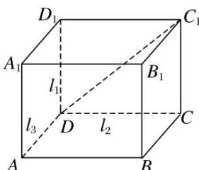

> [!faq]- 《专题02 立体几何中空间线、面位置关系的判定(1)-立体几何（文理通用）》例题解析
>
> > [!success]- **【答案】** D
>
> > [!note]- **【分析】**
> > 本题未单列分析。
>
> > [!note]- **【解析】**
> > 答案 D 解析 如图，在长方体 $ABCD - A_1B_1C_1D_1$ 中，记 $l_{1} = DD_{1}$ ， $l_{2} = DC$ ， $l_{3} = DA$ 。若 $l_{4} = AA_{1}$ ，满足 $l_{1} \perp l_{2}$ ， $l_{2} \perp l_{3}$ ， $l_{3} \perp l_{4}$ ，此时 $l_{1} // l_{4}$ ，可以排除选项A和C。若取 $C_1D$ 为 $l_{4}$ ，则 $l_{1}$ 与 $l_{4}$ 相交；若取 $BA$ 为 $l_{4}$ ，则 $l_{1}$ 与 $l_{4}$ 异面；若取 $C_1D_1$ 为 $l_{4}$ ，则 $l_{1}$ 与 $l_{4}$ 相交且垂直。因此 $l_{1}$ 与 $l_{4}$ 的位置关系不能确定。
> > 
