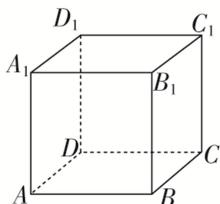

> [!faq]- 《专题02 立体几何中空间线、面位置关系的判定(1)-立体几何（文理通用）》例题解析
>
> > [!success]- **【答案】** B
>
> > [!note]- **【分析】**
> > 本题未单列分析。
>
> > [!note]- **【解析】**
> > 答案 A 解析 对于选项 A，由 $n \parallel \beta$ ， $\alpha \parallel \beta$ 可得 $n \parallel \alpha$ 或 $n \subset \alpha$ ，又 $m \perp \alpha$ ，所以可得 $m \perp n$ ，故 A 正确；对于选项 B，由条件可得 $m \perp n$ 或 $m \parallel n$ ，或 m 与 n 既不垂直也不平行，故 B 不正确；对于选项 C，由条件可得 $m \parallel n$ 或 m，n 相交或 m，n 异面，故 C 不正确；对于选项 D，由题意得 $m \perp n$ ，故 D 不正确.
> > (2) $\alpha,\beta$ 是两个不重合的平面，在下列条件下，可判定 $\alpha\parallel\beta$ 的是( )
> > A. $\alpha,\beta$ 都平行于直线 l,m
> > B. $\alpha$ 内有三个不共线的点到 $\beta$ 的距离相等
> > C. l,m 是 $\alpha$ 内的两条直线且 $l\parallel\beta$ , $m\parallel\beta$ D. l,m 是两条异面直线且 $l\parallel\alpha$ , $m\parallel\alpha$ , $l\parallel\beta$ , $m\parallel\beta$
> > 答案 D 解析 对于 A, l, m 应相交；对于 B，应考虑三个点在 $\beta$ 的同侧或异侧两种情况；对于 C, l, m 应相交，故选 D.
> > (3)(2020·浙江)已知空间中不过同一点的三条直线 $m, n, l$ ，则“ $m, n, l$ 在同一平面”是“ $m, n, l$ 两两相交”的（）
> > A. 充分不必要条件 B. 必要不充分条件 C. 充分必要条件 D. 既不充分也不必要条件
> > 答案 B 解析 依题意 $m, n, l$ 是空间中不过同一点的三条直线，当 $m, n, l$ 在同一平面时，可能有 $m // n // l$ ，故不能得出 $m, n, l$ 两两相交。当 $m, n, l$ 两两相交时，设 $m \cap n = A, m \cap l = B, n \cap l = C$ ，则 $m, n$ 确定一个平面 $\alpha$ ，而 $B \in m \subset \alpha, C \in n \subset \alpha$ ，所以直线 $BC$ 即 $l \subset \alpha$ ，所以 $m, n, l$ 在同一平面。综上所述，“ $m, n, l$ 在同一平面”是“ $m, n, l$ 两两相交”的必要不充分条件。故选 B.
> > (4)(2019·全国II)设 $\alpha$ ， $\beta$ 为两个平面，则 $\alpha\parallel\beta$ 的充要条件是( )
> > A. $\alpha$ 内有无数条直线与 $\beta$ 平行
> > B. $\alpha$ 内有两条相交直线与 $\beta$ 平行
> > C. $\alpha$ ， $\beta$ 平行于同一条直线
> > D. $\alpha$ ， $\beta$ 垂直于同一平面
> > 答案 B 解析 若 $\alpha // \beta$ ，则 $\alpha$ 内有无数条直线与 $\beta$ 平行，反之则不成立；若 $\alpha$ ， $\beta$ 平行于同一条直线，则 $\alpha$ 与 $\beta$ 可以平行也可以相交；若 $\alpha$ ， $\beta$ 垂直于同一个平面，则 $\alpha$ 与 $\beta$ 可以平行也可以相交，故 A，C，D 中条件均不是 $\alpha // \beta$ 的充要条件。根据平面与平面平行的判定定理知，若一个平面内有两条相交直线与另一个平面平行，则两平面平行，反之也成立。因此，B 中条件是 $\alpha // \beta$ 的充要条件。故选 B。
> > (5)已知 $\alpha, \beta$ 表示两个不同平面， $a, b$ 表示两条不同直线，对于下列两个命题：
> > - **①**：若 $b \subset \alpha, a \notin \alpha$ ，则“ $a // b$ ”是“ $a // \alpha$ ”的充分不必要条件；
> > - **②**：若 $a \subset \alpha, b \subset \alpha$ ，则“ $\alpha // \beta$ ”是“ $a // \beta$ 且 $b // \beta$ ”的充要条件。
> > 判断正确的是（ ）
> > A. ①②都是真命题
> > B. ①是真命题，②是假命题
> > C. ①是假命题，②是真命题
> > D. ①②都是假命题
> > 答案 B 解析 若 $b \subset \alpha, a \notin \alpha, a // b$ ，则由线面平行的判定定理可得 $a // \alpha$ ，反过来，若 $b \subset \alpha, a \notin \alpha, a // \alpha$ ，则 $a, b$ 可能平行或异面，则 $b \subset \alpha, a \notin \alpha, “a // b”$ 是“ $a // \alpha$ ”的充分不必要条件，①是真命题；若 $a \subset \alpha, b \subset \alpha, a // \beta$ ，则由面面平行的性质可得 $a // \beta, b // \beta$ ，反过来，若 $a \subset \alpha, b \subset \alpha, a // \beta, b // \beta$ ，则 $\alpha, \beta$ 可能平行或相交，则 $a \subset \alpha, b \subset \alpha$ ，则“ $\alpha // \beta$ ”是“ $a // \beta, b // \beta$ ”的充分不必要条件，②是假命题，选项 B 正确.
> > (6)已知 $\alpha, \beta$ 是空间两个不同的平面， $m, n$ 是空间两条不同的直线，则给出的下列说法正确的是（ ）
> > - **①**：$m // \alpha, n // \beta$ ，且 $m // n$ ，则 $\alpha // \beta$ ；
> > - **②**：$m // \alpha, n // \beta$ ，且 $m \perp n$ ，则 $\alpha \perp \beta$ ；
> > - **③**：$m \perp \alpha, n \perp \beta$ ，且 $m // n$ ，则 $\alpha // \beta$ ；
> > - **④**：$m \perp \alpha, n \perp \beta$ ，且 $m \perp n$ ，则 $\alpha \perp \beta$ 。
> > A. ①②③
> > B. ①③④
> > C. ②④
> > D. ③④
> > 答案 D 解析 对于①，当 $m \parallel \alpha, n \parallel \beta$ ，且 $m \parallel n$ 时，有 $\alpha \parallel \beta$ 或 $\alpha, \beta$ 相交，所以①错误；
> > - **对于②**：，当 $m \parallel \alpha, n \parallel \beta$ ，且 $m \perp n$ 时，有 $\alpha \perp \beta$ 或 $\alpha \parallel \beta$ 或 $\alpha, \beta$ 相交且不垂直，所以②错误；
> > - **对于③**：，当 $m \perp \alpha, n \perp \beta$ ，且 $m \parallel n$ 时，得出 $m \perp \beta$ ，所以 $\alpha \parallel \beta$ ，③正确；
> > - **对于④**：，当 $m \perp \alpha, n \perp \beta$ ，且 $m \perp n$ 时， $\alpha \perp \beta$ 成立，所以④正确。综上知，正确的命题序号是③④。故选 D.
> > (7)已知 m，n 是两条不同的直线， $\alpha$ ， $\beta$ 是两个不同的平面，给出四个命题：
> > - **①**：若 $\alpha\cap\beta=m,\ n\subset\alpha,\ n\perp m$ ，则 $\alpha\perp\beta$ ；
> > - **②**：若 $m\perp\alpha,\ m\perp\beta$ ，则 $\alpha//\beta$ ;
> > $$
> > m \perp \alpha , n \perp \beta , m \perp n,
> > $$
> > $$
> > \alpha \perp \beta ;
> > $$
> > $$
> > m \mathbin {/ /} \alpha , n \mathbin {/ /} \beta , m \mathbin {/ /} n,
> > $$
> > $$
> > \alpha / / \beta .
> > $$
> > 答案 B 解析 两个平面斜交时也会出现一个平面内的直线垂直于两个平面的交线的情况，①不正确；垂直于同一条直线的两个平面平行，②正确；当两个平面与两条互相垂直的直线分别垂直时，它们所成的二面角为直二面角，故③正确；当两个平面相交时，分别与两个平面平行的直线也平行，故④不正确.
> > (8)(2020·全国Ⅱ)设有下列四个命题：
> > - **①**：两两相交且不过同一点的三条直线必在同一平面内；
> > - **②**：过空间中任意三点有且仅有一个平面；
> > - **③**：若空间两条直线不相交，则这两条直线平行；
> > - **④**：若直线 $l \subset$ 平面 $\alpha$ ，直线 $m \perp$ 平面 $\alpha$ ，则 $m \perp l$ .
> > 则上述命题中所有真命题的序号是\_\_\_\_．(填写所有正确命题的序号)
> > 答案 ①④ 解析 ①是真命题，两两相交且不过同一点的三条直线必定有三个交点，且这三个交点不在同一条直线上，由平面的基本性质“经过不在同一直线上的三个点，有且只有一个平面”，可知①为真命题；
> > - **②**：是假命题，因为空间三点在一条直线上时，有无数个平面过这三个点；
> > - **③**：是假命题，因为空间两条直线不相交时，它们可能平行，也可能异面；
> > - **④**：是真命题，因为一条直线垂直于一个平面，那么它垂直于平面内的所有直线．从而①④为真命题.
> > (9)(2019·北京)已知 $l$ ， $m$ 是平面 $\alpha$ 外的两条不同直线．给出下列三个论断：
> > - **①**：$l \perp m$ ;
> > - **②**：$m \parallel \alpha$ ;
> > - **③**：$l \perp \alpha$ .
> > 以其中的两个论断作为条件，余下的一个论断作为结论，写出一个正确的命题：\_\_\_\_。
> > 答案 若 $m \parallel \alpha$ 且 $l \perp \alpha$ , 则 $l \perp m$ (或若 $l \perp m, l \perp \alpha$ , 则 $m \parallel \alpha$ ) 解析 已知 $l, m$ 是平面 $\alpha$ 外的两条不同直线, 由① $l \perp m$ 与② $m \parallel \alpha$ , 不能推出③ $l \perp \alpha$ , 因为 $l$ 可以与 $\alpha$ 平行, 也可以相交不垂直; 由① $l \perp m$ 与③ $l \perp \alpha$ 能推出② $m \parallel \alpha$ ; 由② $m \parallel \alpha$ 与③ $l \perp \alpha$ 可以推出① $l \perp m$ . 故正确的命题是②③⇒①或①③⇒②.
> > (10)设 $\alpha, \beta, \gamma$ 是三个不同的平面， $m, n$ 是两条不同的直线，在命题“ $\alpha \cap \beta = m, n \subset \gamma$ ，且\_\_\_\_，则 $m // n$ ”中的横线处填入下列三组条件中的一组，使该命题为真命题.
> > - **①**：$\alpha\parallel\gamma,\ n\subset\beta;\ ②m\parallel\gamma,\ n\parallel\beta;\ ③n\parallel\beta,\ m\subset\gamma.$
> > 可以填入的条件有\_\_\_\_。
> > 答案 ①或③ 解析 由面面平行的性质定理可知，①正确；当 $n \parallel \beta, m \subset \gamma$ 时， $n$ 和 $m$ 在同一平面内，且没有公共点，所以平行，③正确.
> > 
> > ## 【对点精练】
