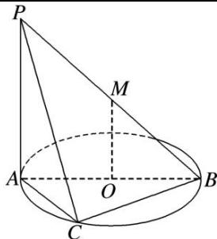

<!-- question-source:start -->
(9)如图所示, 直线 $PA$ 垂直于 $\odot O$ 所在的平面, $\triangle ABC$ 内接于 $\odot O$ , 且 $AB$ 为 $\odot O$ 的直径, 点 $M$ 为线段 $PB$ 的中点. 现有结论: ① $BC \perp PC$ ; ② $OM \parallel$ 平面 $APC$ ; ③ 点 $B$ 到平面 $PAC$ 的距离等于线段 $BC$ 的长. 其中正确的是 ( )

A. ①② B. ①②③ C. ① D. ②③
<!-- question-source:end -->

![[高中/总复习/专题/立体几何/专题03 空间线面位置关系判定2/专题03_立体几何中空间线_面位置关系的判定_2_/例题/answers/Q00043517A1.md]]
