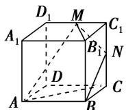

<!-- question-source:start -->
6. 如图，在正方体 $ABCDA_{1}B_{1}C_{1}D_{1}$ 中， $M$ ， $N$ 分别为棱 $C_{1}D_{1}$ ， $C_{1}C$ 的中点，有以下四个结论：① 直线 $AM$ 与 $CC_{1}$ 是相交直线；② 直线 $AM$ 与 $BN$ 是平行直线；③ 直线 $BN$ 与 $MB_{1}$ 是异面直线；④ 直线 $MN$ 与 $AC$ 所成的角为 $60^{\circ}$ 。

其中正确的结论为\_\_\_\_(把你认为正确结论的序号都填上).

<!-- question-source:end -->

![[高中/总复习/专题/立体几何/专题03 空间线面位置关系判定2/专题03_立体几何中空间线_面位置关系的判定_2_/对点训练/answers/Q00039541A1.md]]
