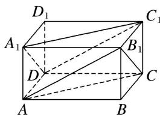

<!-- question-source:start -->
8. 如图所示，在长方体 $ABCD-A_{1}B_{1}C_{1}D_{1}$ 中，平面 $AB_{1}C$ 与平面 $A_{1}DC_{1}$ 的位置关系是 \_\_\_\_.

<!-- question-source:end -->

![[高中/总复习/专题/立体几何/专题03 空间线面位置关系判定2/专题03_立体几何中空间线_面位置关系的判定_2_/对点训练/answers/Q00039543A1.md]]
