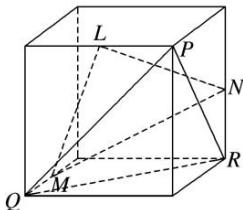

<!-- question-source:start -->
9. 如图, $L$ , $M$ , $N$ 分别为正方体对应棱的中点, 则平面 $LMN$ 与平面 $PQR$ 的位置关系是( )

A. 垂直 B. 相交不垂直 C. 平行 D. 重合
<!-- question-source:end -->

![[高中/总复习/专题/立体几何/专题03 空间线面位置关系判定2/专题03_立体几何中空间线_面位置关系的判定_2_/对点训练/answers/Q00039544A1.md]]
