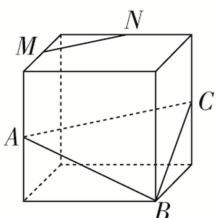
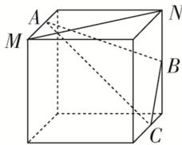
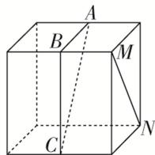
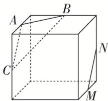

<!-- question-source:start -->
12. 若点 $A, B, C, M, N$ 为正方体的顶点或所在棱的中点，则下列各图中，不满足直线 $MN \parallel$ 平面 $ABC$ 的是（）

  
A

  
B

  
C

  
D
<!-- question-source:end -->

![[高中/总复习/专题/立体几何/专题03 空间线面位置关系判定2/专题03_立体几何中空间线_面位置关系的判定_2_/对点训练/answers/Q00039547A1.md]]
