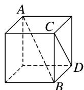
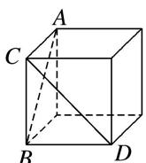
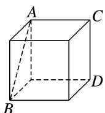
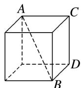

<!-- question-source:start -->
14. 在下列四个正方体中, 能得出异面直线 $AB \perp CD$ 的是( )

A

B

C

D
<!-- question-source:end -->

![[高中/总复习/专题/立体几何/专题03 空间线面位置关系判定2/专题03_立体几何中空间线_面位置关系的判定_2_/对点训练/answers/Q00039549A1.md]]
