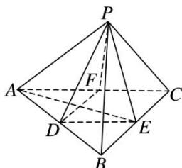

<!-- question-source:start -->
19. 如图, 在正四面体 $P - ABC$ 中, $D, E, F$ 分别是 $AB, BC, CA$ 的中点, 下面四个结论不成立的是 ( )

A. $BC \parallel$ 平面 $PDF$ B. $DF \perp$ 平面 $PAE$ C. 平面 $PDF \perp$ 平面 $PAE$ D. 平面 $PDE \perp$ 平面 $ABC$ 19. 答案 D 解析 因为 $BC \parallel DF$ , $DF \subset$ 平面 $PDF$ , $BC \not\subset$ 平面 $PDF$ , 所以 $BC \parallel$ 平面 $PDF$ , 故选项 A 正确；在正四面体中， $AE \perp BC$ ， $PE \perp BC$ ， $AE \cap PE = E$ ，且 AE， $PE \subset$ 平面 PAE，所以 $BC \perp$ 平面 PAE，因为 $DF \parallel BC$ ，所以 $DF \perp$ 平面 PAE，又 $DF \subset$ 平面 PDF，从而平面 $PDF \perp$ 平面 PAE。因此选项 B，C 均正确。
<!-- question-source:end -->
