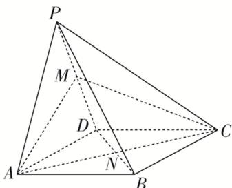

<!-- question-source:start -->
24. (多选)如图, 四棱锥 $P - ABCD$ 中, 平面 $PAD \perp$ 底面 $ABCD$ , $\triangle PAD$ 是等边三角形, 底面 $ABCD$ 是菱形, 且 $\angle BAD = 60^{\circ}$ , $M$ 为棱 $PD$ 的中点, $N$ 为菱形 $ABCD$ 的中心, 下列结论正确的有( )

A. 直线 $PB$ 与平面 $AMC$ 平行 B. 直线 $PB$ 与直线 $AD$ 垂直 C. 线段 $AM$ 与线段 $CM$ 长度相等 D. $PB$ 与 $AM$ 所成角的余弦值为 $\frac{\sqrt{2}}{4}$
<!-- question-source:end -->

![[高中/总复习/专题/立体几何/专题03 空间线面位置关系判定2/专题03_立体几何中空间线_面位置关系的判定_2_/对点训练/answers/Q00039558A1.md]]
