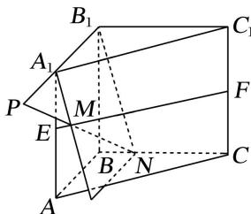
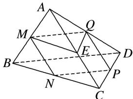

> [!faq]- 《专题03 空间线面位置关系判定2》例题解析
>
> > [!success]- **【答案】** D
>
> > [!note]- **【解析】**
> > 答案 D 解析 在 EF 上任意取一点 M，直线 $A_{1}B_{1}$ 与 M 确定一个平面，这个平面与 BC 有且仅有 1 个交点 N，当 M 的位置不同时确定不同的平面，从而与 BC 有不同的交点 N，而直线 MN 与 $A_{1}B_{1}$ ，EF，
> >
> > BC 分别有交点 P, M, N, 如图, 故有无数条直线与直线 $A_{1}B_{1}$ , EF, BC 都相交.
> >
> > 
> >
> > 3. (多选)如图, 在四面体 $A - BCD$ 中, $M, N, P, Q, E$ 分别为 $AB, BC, CD, AD, AC$ 的中点, 则下列说法中正确的是( )
> >
> > 
> >
> > A. $M, N, P, Q$ 四点共面 B. $\angle QME = \angle CBD$ C. $\triangle BCD \sim \triangle MEQ$ D. 四边形 $MNPQ$ 为梯形
> >
> > 3. 答案 ABC 解析 由三角形的中位线定理，易知 $MQ \parallel BD$ ， $ME \parallel BC$ ， $QE \parallel CD$ ， $NP \parallel BD$ 。对于 A，有 $MQ \parallel NP$ ，所以 M，N，P，Q 四点共面，故 A 说法正确；对于 B，根据等角定理，得 $\angle QME = \angle CBD$ ，故 B 说法正确；对于 C，由等角定理，知 $\angle QME = \angle CBD$ ， $\angle MEQ = \angle BCD$ ，所以 $\triangle BCD \sim \triangle MEQ$ ，故 C 说法正确；对于 D，由三角形的中位线定理，知 $MQ \parallel BD$ ， $MQ = \frac{1}{2} BD$ ， $NP \parallel BD$ ， $NP = \frac{1}{2} BD$ ，所以 $MQ = NP$ ， $MQ \parallel NP$ ，所以四边形 MNPQ 是平行四边形，故 D 说法不正确。
