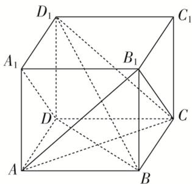

> [!faq]- 《专题03 空间线面位置关系判定2》例题解析
>
> > [!success]- **【答案】** D
>
> > [!note]- **【解析】**
> > 答案 D 解析 如图，连接 $AB_{1}$ ，可得 $\triangle AB_{1}C$ 为正三角形，可得 AC 与 $B_{1}C$ 是相交直线且成 $60^{\circ}$ 角，故 A 错误；∵ $A_{1}D \parallel B_{1}C$ ，∴ AC 与 $A_{1}D$ 是异面直线且成 $60^{\circ}$ 角，故 B 错误； $BD_{1}$ 与 BC 是相交直线，所成角为 $\angle D_{1}BC$ ，其正切值为 $\sqrt{2}$ ，故 C 错误；连接 BD，可知 $BD \perp AC$ ，则 $BD_{1} \perp AC$ ，可知 AC 与 $BD_{1}$ 是异面直线且垂直，故 D 正确．故选 D．
> >
> > 
