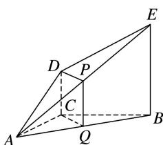

> [!faq]- 《专题03 空间线面位置关系判定2》例题解析
>
> > [!success]- **【答案】** 详见解析
>
> > [!note]- **【解析】**
> > 答案 平行 解析 连接 $CQ$ ，在 $\triangle ABE$ 中， $P, Q$ 分别是 $AE, AB$ 的中点，所以 $PQ \parallel BE, PQ = \frac{1}{2} BE$ .
> >
> > 
> >
> > 又 $DC \parallel EB, DC = \frac{1}{2} EB$ ，所以 $PQ \parallel DC, PQ = DC$ ，所以四边形 $DPQC$ 为平行四边形，所以 $DP \parallel CQ$ . 又 $DP \nsubseteq$ 平面 $ABC, CQ \subset$ 平面 $ABC$ ，所以 $DP \parallel$ 平面 $ABC$ .
