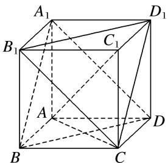

> [!faq]- 《专题03 空间线面位置关系判定2》例题解析
>
> > [!success]- **【答案】** 详见解析
>
> > [!note]- **【解析】**
> > 答案 6 解析 如图所示，在正方体 $ABCD - A_{1}B_{1}C_{1}D_{1}$ 中， $BD \perp AC$ 。\$\because C\_{1}C \perp \text{平面 } BCD, BD \subset \text{平面 } BCD\$
> >
> > 
> >
> > $\therefore C_{1}C \perp BD$ ，又 $AC \cap CC_{1} = C$ ， $\therefore BD \perp$ 平面 $ACC_{1}$ ，又 $\because AC_{1} \subset$ 平面 $ACC_{1}$ ， $\therefore AC_{1} \perp BD$ 。同理 $A_{1}B$ ， $A_{1}D$ ， $B_{1}D_{1}$ ， $CD_{1}$ ， $B_{1}C$ 都与 $AC_{1}$ 垂直。正方体 $ABCD - A_{1}B_{1}C_{1}D_{1}$ 的棱中没有与 $AC_{1}$ 垂直的棱，故与体对角线 $AC_{1}$ 垂直的有6条。
