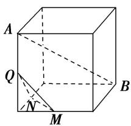
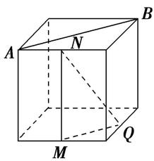
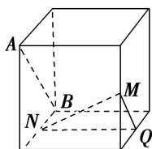
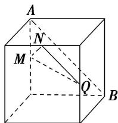

<!-- question-source:start -->
(4)(2017·全国 I)如图，在下列四个正方体中，A, B 为正方体的两个顶点，M, N, Q 为所在棱的中点，则在这四个正方体中，直线 AB 与平面 MNQ 不平行的是()

  
A

  
B

  
C

  
D
<!-- question-source:end -->

![[高中/总复习/专题/立体几何/专题03 立体几何中空间线、面位置关系的判定(2)-立体几何（文理通用）/专题03_立体几何中空间线_面位置关系的判定_2_/例题/answers/Q00043512A1.md]]
