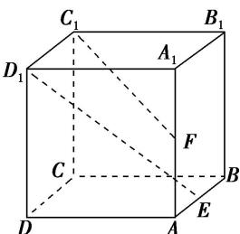

<!-- question-source:start -->
(5)已知点 E, F 分别是正方体 $ABCD-A_{1}B_{1}C_{1}D_{1}$ 的棱 AB, $AA_{1}$ 的中点，点 M, N 分别是线段 $D_{1}E$ 与 $C_{1}F$ 上的点，则满足与平面 ABCD 平行的直线 MN 有()

A. 0 条 B. 1 条 C. 2 条 D. 无数条
<!-- question-source:end -->

![[高中/总复习/专题/立体几何/专题03 立体几何中空间线、面位置关系的判定(2)-立体几何（文理通用）/专题03_立体几何中空间线_面位置关系的判定_2_/例题/answers/Q00043513A1.md]]
