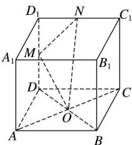

<!-- question-source:start -->
(6)如图所示，在正方体 $ABCD - A_{1}B_{1}C_{1}D_{1}$ 中，点 $O, M, N$ 分别是线段 $BD, DD_{1}, D_{1}C_{1}$ 的中点，则直线 $OM$ 与 $AC, MN$ 的位置关系是（）

A. 与 $AC$ ， $MN$ 均垂直 B. 与 $AC$ 垂直，与 $MN$ 不垂直 C. 与 $AC$ 不垂直，与 $MN$ 垂直 D. 与 $AC$ ， $MN$ 均不垂直
<!-- question-source:end -->

![[高中/总复习/专题/立体几何/专题03 立体几何中空间线、面位置关系的判定(2)-立体几何（文理通用）/专题03_立体几何中空间线_面位置关系的判定_2_/例题/answers/Q00043514A1.md]]
