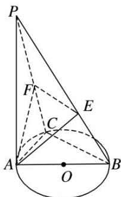

<!-- question-source:start -->
(7)如图， $PA \perp$ 圆 O 所在的平面，AB 是圆 O 的直径，C 是圆 O 上的一点，E，F 分别是点 A 在 PB，PC 上的射影，给出下列结论：

① $AF \perp PB$ ; ② $EF \perp PB$ ; ③ $AF \perp BC$ ; ④ $AE \perp$ 平面 PBC.

其中正确结论的序号是\_\_\_\_。

<!-- question-source:end -->

![[高中/总复习/专题/立体几何/专题03 立体几何中空间线、面位置关系的判定(2)-立体几何（文理通用）/专题03_立体几何中空间线_面位置关系的判定_2_/例题/answers/Q00043515A1.md]]
