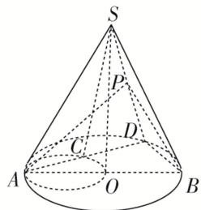

<!-- question-source:start -->
(8)如图， $AB$ 是圆锥 $SO$ 的底面圆 $O$ 的直径， $D$ 是圆 $O$ 上异于 $A$ ， $B$ 的任意一点，以 $AO$ 为直径的圆与 $AD$ 的另一个交点为 $C$ ， $P$ 为 $SD$ 的中点．现给出以下结论：

①△SAC 为直角三角形；②平面 $SAD \perp$ 平面 SBD；③平面 PAB 必与圆锥 SO 的某条母线平行。其中正确结论的序号是 \_\_\_\_ (写出所有正确结论的序号).
<!-- question-source:end -->

![[高中/总复习/专题/立体几何/专题03 立体几何中空间线、面位置关系的判定(2)-立体几何（文理通用）/专题03_立体几何中空间线_面位置关系的判定_2_/例题/answers/Q00043516A1.md]]
