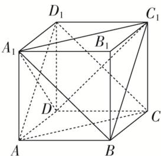

> [!faq]- 《专题03 立体几何中空间线、面位置关系的判定(2)-立体几何（文理通用）》例题解析
>
> > [!success]- **【答案】** AD
>
> > [!note]- **【分析】**
> > 本题未单列分析。
>
> > [!note]- **【解析】**
> > 答案 AD 解析 如图，由 $A_{1}B \parallel D_{1}C$ ，且 $A_{1}B \not\subset$ 平面 $ACD_{1}$ ， $D_{1}C \subset$ 平面 $ACD_{1}$ ，故直线 $A_{1}B$ 与平面 $ACD_{1}$ 平行，故 A 正确；直线 $BB_{1} \parallel DD_{1}$ ， $DD_{1}$ 与平面 $ACD_{1}$ 相交，故直线 $BB_{1}$ 与平面 $ACD_{1}$ 相交，故 B 错误；显然平面 $A_{1}DC_{1}$ 与平面 $ACD_{1}$ 相交，故 C 错误；由 $A_{1}B \parallel D_{1}C$ ， $AC \parallel A_{1}C_{1}$ ，且 $A_{1}B \cap A_{1}C_{1} = A_{1}$ ， $AC \cap D_{1}C = C$ ，故平面 $A_{1}BC_{1}$ 与平面 $ACD_{1}$ 平行，故 D 正确．故选 AD.
> > 
