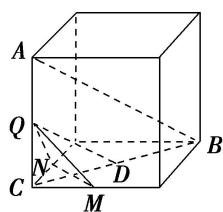
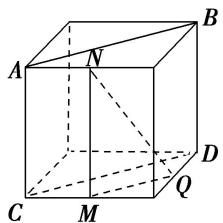
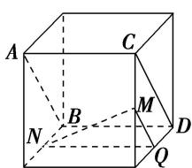
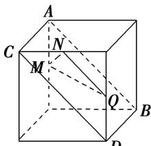

> [!faq]- 《专题03 立体几何中空间线、面位置关系的判定(2)-立体几何（文理通用）》例题解析
>
> > [!success]- **【答案】** A
>
> > [!note]- **【分析】**
> > 本题未单列分析。
>
> > [!note]- **【解析】**
> > 答案 A 解析 A 项, 作如图①所示的辅助线, 其中 D 为 BC 的中点, 则 $QD \parallel AB$ . $\because QD \cap$ 平面 MNQ = Q, $\therefore QD$ 与平面 MNQ 相交, $\therefore$ 直线 AB 与平面 MNQ 相交. B 项, 作如图②所示的辅助线, 则 $AB \parallel CD$ , $CD \parallel MQ$ , $\therefore AB \nparallel MQ$ , 又 $AB \nsubseteq$ 平面 MNQ, $MQ \subset$ 平面 MNQ, $\therefore AB \parallel$ 平面 MNQ. C 项, 作如图③所示的辅助线, 则 $AB \parallel CD$ , $CD \parallel MQ$ , $\therefore AB \parallel MQ$ , 又 $AB \nsubseteq$ 平面 MNQ, $MQ \subset$ 平面 MNQ, $\therefore AB \parallel$ 平面 MNQ. D 项, 作如图④所示的辅助线, 则 $AB \parallel CD$ , $CD \parallel NQ$ , $\therefore AB \parallel NQ$ , 又 $AB \nsubseteq$ 平面 MNQ, $NQ \subset$ 平面 MNQ, $\therefore AB \parallel$ 平面 MNQ. 故选 A.
> > 
> > - **①**：
> > - **②**：
> > - **③**：
> > - **④**：
