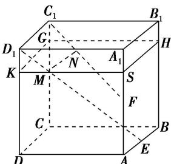

> [!faq]- 《专题03 立体几何中空间线、面位置关系的判定(2)-立体几何（文理通用）》例题解析
>
> > [!success]- **【答案】** D
>
> > [!note]- **【分析】**
> > 本题未单列分析。
>
> > [!note]- **【解析】**
> > 答案 D 解析 如图所示，作平面 $KSHG \parallel$ 平面 $ABCD$ ， $C_1F$ ， $D_1E$ 交平面 $KSHG$ 于点 $N$ ， $M$ ，连接 $MN$ ，由面面平行的性质得 $MN \parallel$ 平面 $ABCD$ ，由于平面 $KSHG$ 有无数多个，所以平行于平面 $ABCD$ 的 $MN$ 有无数多条，故选 D.
> > 
