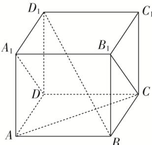

<!-- question-source:start -->
4. 如图，在正方体 $ABCD-A_{1}B_{1}C_{1}D_{1}$ 中，下列命题正确的是()

A. $AC$ 与 $B_{1}C$ 是相交直线且垂直 B. $AC$ 与 $A_{1}D$ 是异面直线且垂直 C. $BD_{1}$ 与 $BC$ 是相交直线且垂直 D. $AC$ 与 $BD_{1}$ 是异面直线且垂直
<!-- question-source:end -->

![[高中/总复习/专题/立体几何/专题03 立体几何中空间线、面位置关系的判定(2)-立体几何（文理通用）/专题03_立体几何中空间线_面位置关系的判定_2_/对点训练/answers/Q00039539A1.md]]
