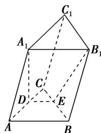

<!-- question-source:start -->
5. 如图所示的三棱柱 $ABC - A_{1}B_{1}C_{1}$ 中，过 $A_{1}B_{1}$ 的平面与平面 $ABC$ 交于 $DE$ ，则 $DE$ 与 $AB$ 的位置关系是（）A. 异面 B. 平行 C. 相交 D. 以上均有可能

<!-- question-source:end -->

![[高中/总复习/专题/立体几何/专题03 立体几何中空间线、面位置关系的判定(2)-立体几何（文理通用）/专题03_立体几何中空间线_面位置关系的判定_2_/对点训练/answers/Q00039540A1.md]]
