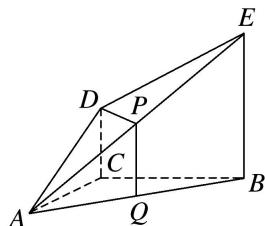

<!-- question-source:start -->
7. 如图, $DC \perp$ 平面 $ABC$ , $EB \parallel DC$ , $EB = 2DC$ , $P$ , $Q$ 分别为 $AE$ , $AB$ 的中点. 则直线 $DP$ 与平面 $ABC$ 的位置关系是 \_\_\_\_.

<!-- question-source:end -->

![[高中/总复习/专题/立体几何/专题03 立体几何中空间线、面位置关系的判定(2)-立体几何（文理通用）/专题03_立体几何中空间线_面位置关系的判定_2_/对点训练/answers/Q00039542A1.md]]
