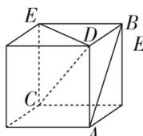
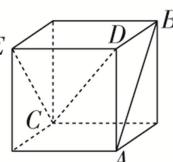
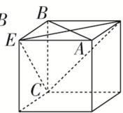
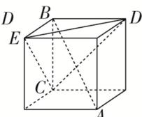

<!-- question-source:start -->
16. (多选)如图，在以下四个正方体中，直线 $AB$ 与平面 $CDE$ 垂直的是( )

A  

B  

  
C

  
D
<!-- question-source:end -->

![[高中/总复习/专题/立体几何/专题03 立体几何中空间线、面位置关系的判定(2)-立体几何（文理通用）/专题03_立体几何中空间线_面位置关系的判定_2_/对点训练/answers/Q00039551A1.md]]
