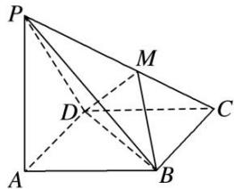

<!-- question-source:start -->
20. 如图所示, 在四棱锥 $P - ABCD$ 中, $PA \perp$ 底面 $ABCD$ , 且底面各边都相等, $M$ 是 $PC$ 上的一动点, 当点 $M$ 满足 \_\_\_\_ 时, 平面 $MBD \perp$ 平面 $PCD$ . (只要填写一个你认为正确的条件即可)

<!-- question-source:end -->

![[高中/总复习/专题/立体几何/专题03 立体几何中空间线、面位置关系的判定(2)-立体几何（文理通用）/专题03_立体几何中空间线_面位置关系的判定_2_/对点训练/answers/Q00039554A1.md]]
