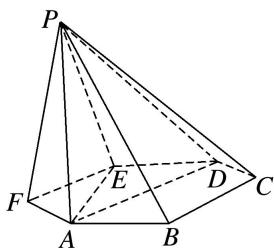

<!-- question-source:start -->
22. 如图，已知六棱锥 P-ABCDEF 的底面是正六边形，PA⊥平面 ABC，PA=2AB，

则下列结论中：① $PB \perp AE$ ；②平面 ABC⊥平面 PBC；③直线 BC∥平面 PAE；④ $\angle PDA = 45^{\circ}$ . 正确的为 \_\_\_\_ (把所有正确的序号都填上).
<!-- question-source:end -->

![[高中/总复习/专题/立体几何/专题03 立体几何中空间线、面位置关系的判定(2)-立体几何（文理通用）/专题03_立体几何中空间线_面位置关系的判定_2_/对点训练/answers/Q00039556A1.md]]
