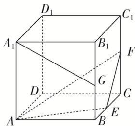

<!-- question-source:start -->
23. (多选)正方体 $ABCD - A_{1}B_{1}C_{1}D_{1}$ 的棱长为 1, E, F, G 分别为 BC, $CC_{1}$ , $BB_{1}$ 的中点, 则( )

A. 直线 $D_{1} D$ 与直线 $A F$ 垂直 B. 直线 $A_{1} G$ 与平面 $A E F$ 平行 C. 平面 $A E F$ 截正方体所得的截面面积为 $\frac {9}{8}$ D. 点 $C$ 与点 $G$ 到平面 $A E F$ 的距离相等
<!-- question-source:end -->

![[高中/总复习/专题/立体几何/专题03 立体几何中空间线、面位置关系的判定(2)-立体几何（文理通用）/专题03_立体几何中空间线_面位置关系的判定_2_/对点训练/answers/Q00039557A1.md]]
