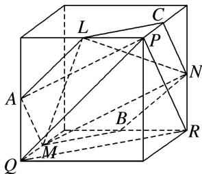

> [!faq]- 《专题03 立体几何中空间线、面位置关系的判定(2)-立体几何（文理通用）》例题解析
>
> > [!success]- **【答案】** C
>
> > [!note]- **【分析】**
> > 本题未单列分析。
>
> > [!note]- **【解析】**
> > 答案 C 解析 如图，分别取另三条棱的中点 A, B, C，将平面 LMN 延展为平面正六边形 AMBNCL，因为 $PQ \parallel AL$ ， $PR \parallel AM$ ，且 PQ 与 PR 相交，AL 与 AM 相交，所以平面 $PQR \parallel$ 平面 AMBNCL，即平面 LMN // 平面 PQR.
> > 
