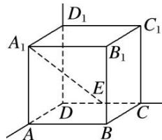

> [!faq]- 《专题03 立体几何中空间线、面位置关系的判定(2)-立体几何（文理通用）》例题解析
>
> > [!success]- **【答案】** A
>
> > [!note]- **【分析】**
> > 本题未单列分析。
>
> > [!note]- **【解析】**
> > 答案 C 解析 如图，∵ $A_{1}E$ 在平面 ABCD 上的射影为 AE，而 AE 不与 AC，BD 垂直，
> >
> > 
> >
> > ∴B，D错；∵ $A_{1}E$ 在平面 $BCC_{1}B_{1}$ 上的射影为 $B_{1}C$ ，且 $B_{1}C\perp BC_{1}$ ，∴ $A_{1}E\perp BC_{1}$ ，故C正确；(证明：由条件易知， $BC_{1}\perp B_{1}C$ ， $BC_{1}\perp CE$ ，又 $CE\cap B_{1}C=C$ ，∴ $BC_{1}\perp$ 平面 $CEA_{1}B_{1}$ 。又 $A_{1}E\subset$ 平面 $CEA_{1}B_{1}$ ，∴ $A_{1}E\perp BC_{1}$ )，∵ $A_{1}E$ 在平面 $DCC_{1}D_{1}$ 上的射影为 $D_{1}E$ ，而 $D_{1}E$ 不与 $DC_{1}$ 垂直，故A错。
