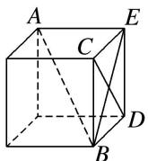
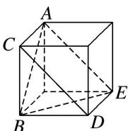

> [!faq]- 《专题03 立体几何中空间线、面位置关系的判定(2)-立体几何（文理通用）》例题解析
>
> > [!success]- **【答案】** A
>
> > [!note]- **【分析】**
> > 本题未单列分析。
>
> > [!note]- **【解析】**
> > 答案 A 解析 对于 A，作出过 AB 的平面 ABE，如图①，可得直线 CD 与平面 ABE 垂直，根据线面垂直的性质知， $AB \perp CD$ 成立，故 A 正确；对于 B，作出过 AB 的等边三角形 ABE，如图②，将 CD平移至 $AE$ ，可得 $CD$ 与 $AB$ 所成的角等于 $60^{\circ}$ ，故 B 不成立；对于 C，D，将 $CD$ 平移至经过点 B 的侧棱处，可得 $AB$ ， $CD$ 所成的角都是锐角，故 C 和 D 均不成立．故选 A.
> > 
> > 图①
> > 
> > 图②
