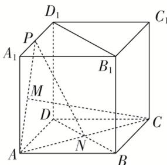
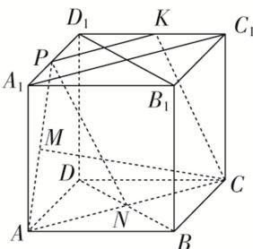

> [!faq]- 《专题03 立体几何中空间线、面位置关系的判定(2)-立体几何（文理通用）》例题解析
>
> > [!success]- **【答案】** B
>
> > [!note]- **【分析】**
> > 本题未单列分析。
>
> > [!note]- **【解析】**
> > 答案 B 解析 由题意得 $BC \perp AC$ ，因为 $VA \perp$ 平面 $ABC$ ， $BC \subset$ 平面 $ABC$ ，所以 $VA \perp BC$ 。因为 $AC$
> >
> > ∩
> >
> > $VA = A$ ，所以 $BC \perp$ 平面 $VAC$ 。因为 $BC \subset$ 平面 $VBC$ ，所以平面 $VAC \perp$ 平面 $VBC$ 。故选 B. 18. (多选)在正方体 $ABCD - A_{1}B_{1}C_{1}D_{1}$ 中， $N$ 为底面 $ABCD$ 的中心， $P$ 为线段 $A_{1}D_{1}$ 上的动点(不包括两个端点)， $M$ 为线段 $AP$ 的中点，则（）
> >
> > 
> >
> > A. $CM$ 与 $PN$ 是异面直线 B. $CM > PN$ C. 平面 $PAN \perp$ 平面 $BDD_{1}B_{1}$ D. 过 $P, A, C$ 三点的正方体的截面一定是等腰梯形
> >
> > 18. 答案 BCD 解析 由 C, N, A 三点共线，得 CN, PM 交于点 A，因此 CM, PN 共面，A 错误；记 $\angle PAC = \theta$ ，则 $PN^{2} = AP^{2} + AN^{2} - 2AP \cdot AN \cos \theta = AP^{2} + \frac{1}{4}AC^{2} - AP \cdot AC \cos \theta$ , $CM^{2} = AC^{2} + AM^{2} - 2AC \cdot AM \cos \theta = AC^{2} + \frac{1}{4}AP^{2} - AP \cdot AC \cos \theta$ ，又 $AP < AC$ , $CM^{2} - PN^{2} = \frac{3}{4}(AC^{2} - AP^{2}) > 0$ ，所以 $CM^{2} > PN^{2}$ ，即 CM > PN，B 正确；在正方体 $ABCD - A_{1}B_{1}C_{1}D_{1}$ 中， $AN \perp BD$ ， $BB_{1} \perp$ 平面 ABCD，则 $BB_{1} \perp AN$ ， $BB_{1} \cap BD = B$ ，可得 $AN \perp$ 平面 $BDD_{1}B_{1}$ ， $AN \subsetneq$ 平面 PAN，从而可得平面 $PAN \perp$ 平面 $BDD_{1}B_{1}$ ，C 正确；在 $C_{1}D_{1}$ 上取一点 K，使得 $D_{1}K = D_{1}P$ ，连接 KP, KC, $A_{1}C_{1}$ ，易知 $PK // A_{1}C_{1}$ ，又在正方体 $ABCD - A_{1}B_{1}C_{1}D_{1}$ 中， $A_{1}C_{1} // AC$ ，所以 $PK // AC$ ，所以 PK, AC 共面，PKCA 就是过 P, A, C 三点的正方体的截面，它是等腰梯形，D 正确。故选 BCD。
> >
> > 
