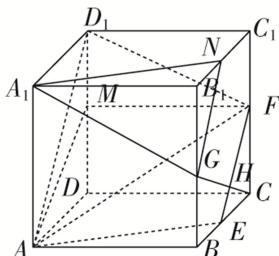

> [!faq]- 《专题03 立体几何中空间线、面位置关系的判定(2)-立体几何（文理通用）》例题解析
>
> > [!success]- **【答案】** BC
>
> > [!note]- **【分析】**
> > 本题未单列分析。
>
> > [!note]- **【解析】**
> > 答案 BC 解析 $\because CC_{1}$ 与 $AF$ 不垂直，而 $DD_{1} // CC_{1}$ ， $\therefore AF$ 与 $DD_{1}$ 不垂直，故 A 错误；取 $B_{1}C_{1}$ 的中点 $N$ ，连接 $A_{1}N$ ， $GN$ ，可得平面 $A_{1}GN //$ 平面 $AEF$ ，则直线 $A_{1}G //$ 平面 $AEF$ ，故 B 正确；把截面 $AEF$ 补形为四边形 $AEFD_{1}$ ，由四边形 $AEFD_{1}$ 为等腰梯形可得平面 $AEF$ 截正方体所得的截面面积 $S = \frac{9}{8}$ ，故 C 正确；假设点 $C$ 与点 $G$ 到平面 $AEF$ 的距离相等，即平面 $AEF$ 将 $CG$ 平分，则平面 $AEF$ 必过 $CG$ 的中点，连接 $CG$ 交 $EF$ 于点 $H$ ，而 $H$ 不是 $CG$ 中点，则假设不成立，故 D 错误．故选 BC.
> >
> > 
