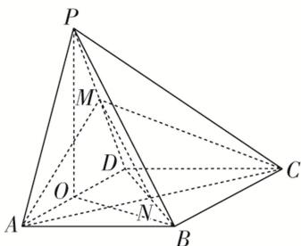

> [!faq]- 《专题03 立体几何中空间线、面位置关系的判定(2)-立体几何（文理通用）》例题解析
>
> > [!success]- **【答案】** ABD
>
> > [!note]- **【分析】**
> > 本题未单列分析。
>
> > [!note]- **【解析】**
> > 答案 ABD 解析 如图，连接 MN，易知 $MN \parallel PB$ ，又 $MN \subset$ 平面 AMC，∴ $PB \parallel$ 平面 AMC，A 正确；在菱形 ABCD 中， $\angle BAD = 60^{\circ}$ ，∴ $\triangle BAD$ 为等边三角形．设 AD 的中点为 O，连接 OB，OP，则 OP $\perp AD, OB \perp AD$ ，∴ $AD \perp$ 平面 POB，又 $PB \subset$ 平面 POB，∴ $AD \perp PB, B$ 正确；由平面 PAD $\perp$ 平面 ABCD，得 $\triangle POB$ 为直角三角形，设 AD = 4，则 $OP = OB = 2\sqrt{3}$ ，∴ $PB = 2\sqrt{6}$ ， $MN = \frac{1}{2}PB = \sqrt{6}$ ．在 $\triangle MAN$ 中，
> >
> > $AM=AN=2\sqrt{3}$ ， $MN=\sqrt{6}$ ，可得 $\cos\angle AMN=\frac{\sqrt{2}}{4}$ ，故异面直线 PB 与 AM 所成角的余弦值为 $\frac{\sqrt{2}}{4}$ ，D 正确； $\because\cos\angle MNC=-\cos\angle MNA=-\cos\angle AMN=-\frac{\sqrt{2}}{4}$ ，又 $NC=2\sqrt{3}$ ， $MN=\sqrt{6}$ ， $\therefore-\frac{\sqrt{2}}{4}=\frac{6+12-CM^{2}}{2\times\sqrt{6}\times2\sqrt{3}}$ ，得 $CM=2\sqrt{6}>AM$ ，C 错误．故选 ABD.
> >
> > 
