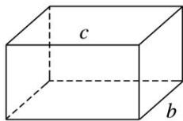

<!-- question-source:start -->
[例 1](1)以下四个命题中，

①不共面的四点中，其中任意三点不共线；

②若点 A, B, C, D 共面，点 A, B, C, E 共面，则点 A, B, C, D, E 共面；

③若直线 a, b 共面，直线 a, c 共面，则直线 b, c 共面；

④依次首尾相接的四条线段必共面.

正确命题的个数是( )
A. 0    B. 1    C. 2    D. 3 答案 B 解析 ①显然

是正确的；②中若 A, B, C 三点共线，则 A, B, C, D, E 五点不一定共面；③中构造长方体(或正方体)，如图所示，显然 b, c 异面，故不正确；④中空间四边形中四条线段不共面，故只有①正确.

  
a
<!-- question-source:end -->

![[高中/总复习/专题/立体几何/专题03 立体几何中空间线、面位置关系的判定(2)-立体几何（文理通用）/专题03_立体几何中空间线_面位置关系的判定_2__立体几何_文理通用_/例题/answers/Q00039536A1.md]]
