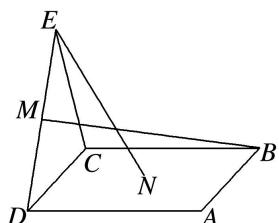
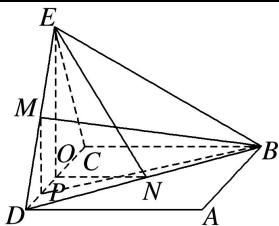
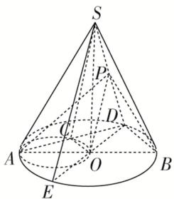

> [!faq]- 《专题03 立体几何中空间线、面位置关系的判定(2)-立体几何（文理通用）》例题解析
>
> > [!success]- **【答案】** AD
>
> > [!note]- **【分析】**
> > 本题未单列分析。
>
> > [!note]- **【解析】**
> > (2)(2019·全国Ⅲ)如图，点 N 为正方形 ABCD 的中心， $\triangle ECD$ 为正三角形，平面 $ECD \perp$ 平面 ABCD，M 是线段 ED 的中点，则()
> > 
> > A. $BM = EN$ ，且直线 $BM$ ， $EN$ 是相交直线 B. $BM\neq EN$ ，且直线 $BM$ ， $EN$ 是相交直线C. $BM = EN$ ，且直线 $BM$ ， $EN$ 是异面直线 D. $BM\neq EN$ ，且直线 $BM$ ， $EN$ 是异面直线
> > 答案 B 解析 如图，取 CD 的中点 O，连接 ON，EO，因为 $\triangle ECD$ 为正三角形，所以 $EO \perp CD$ ，又平面 $ECD \perp$ 平面 ABCD，平面 $ECD \cap$ 平面 ABCD = CD，所以 $EO \perp$ 平面 ABCD。设正方形 ABCD 的边长为 2，则 $EO = \sqrt{3}$ ，ON = 1，所以 $EN^{2} = EO^{2} + ON^{2} = 4$ ，得 EN = 2。过 M 作 CD 的垂线，垂足为 P，连接 BP，则 $MP = \frac{\sqrt{3}}{2}$ ， $CP = \frac{3}{2}$ ，所以 $BM^{2} = MP^{2} + BP^{2} = \left(\frac{\sqrt{3}}{2}\right)^{2} + \left(\frac{3}{2}\right)^{2} + 2^{2} = 7$ ，得 $BM = \sqrt{7}$ ，所以 $BM \neq EN$ 。连接 BD，BE，因为四边形 ABCD 为正方形，所以 N 为 BD 的中点，即 EN，MB 均在平面 BDE 内，所以直线 BM，EN 是相交直线。
> > 
> > (3)(多选)在正方体 $ABCD - A_{1}B_{1}C_{1}D_{1}$ 中，下列直线或平面与平面 $ACD_{1}$ 平行的是( )
> > A. 直线 $A_{1}B$ B. 直线 $BB_{1}$ C. 平面 $A_{1}DC_{1}$ D. 平面 $A_{1}BC_{1}$
> > 答案 AD 解析 如图，由 $A_{1}B \parallel D_{1}C$ ，且 $A_{1}B \not\subset$ 平面 $ACD_{1}$ ， $D_{1}C \subset$ 平面 $ACD_{1}$ ，故直线 $A_{1}B$ 与平面 $ACD_{1}$ 平行，故 A 正确；直线 $BB_{1} \parallel DD_{1}$ ， $DD_{1}$ 与平面 $ACD_{1}$ 相交，故直线 $BB_{1}$ 与平面 $ACD_{1}$ 相交，故 B 错误；显然平面 $A_{1}DC_{1}$ 与平面 $ACD_{1}$ 相交，故 C 错误；由 $A_{1}B \parallel D_{1}C$ ， $AC \parallel A_{1}C_{1}$ ，且 $A_{1}B \cap A_{1}C_{1} = A_{1}$ ， $AC \cap D_{1}C = C$ ，故平面 $A_{1}BC_{1}$ 与平面 $ACD_{1}$ 平行，故 D 正确．故选 AD.
> > 
> > (4)(2017·全国 I)如图，在下列四个正方体中，A, B 为正方体的两个顶点，M, N, Q 为所在棱的中点，则在这四个正方体中，直线 AB 与平面 MNQ 不平行的是()
> > 
> > A
> > 
> > B
> > 
> > C
> > 
> > D
> > 答案 A 解析 A 项, 作如图①所示的辅助线, 其中 D 为 BC 的中点, 则 $QD \parallel AB$ . $\because QD \cap$ 平面 MNQ = Q, $\therefore QD$ 与平面 MNQ 相交, $\therefore$ 直线 AB 与平面 MNQ 相交. B 项, 作如图②所示的辅助线, 则 $AB \parallel CD$ , $CD \parallel MQ$ , $\therefore AB \nparallel MQ$ , 又 $AB \nsubseteq$ 平面 MNQ, $MQ \subset$ 平面 MNQ, $\therefore AB \parallel$ 平面 MNQ. C 项, 作如图③所示的辅助线, 则 $AB \parallel CD$ , $CD \parallel MQ$ , $\therefore AB \parallel MQ$ , 又 $AB \nsubseteq$ 平面 MNQ, $MQ \subset$ 平面 MNQ, $\therefore AB \parallel$ 平面 MNQ. D 项, 作如图④所示的辅助线, 则 $AB \parallel CD$ , $CD \parallel NQ$ , $\therefore AB \parallel NQ$ , 又 $AB \nsubseteq$ 平面 MNQ, $NQ \subset$ 平面 MNQ, $\therefore AB \parallel$ 平面 MNQ. 故选 A.
> > 
> > - **①**：
> > - **②**：
> > - **③**：
> > - **④**：(5)已知点 E, F 分别是正方体 $ABCD-A_{1}B_{1}C_{1}D_{1}$ 的棱 AB, $AA_{1}$ 的中点，点 M, N 分别是线段 $D_{1}E$ 与 $C_{1}F$ 上的点，则满足与平面 ABCD 平行的直线 MN 有()
> > 
> > A. 0 条 B. 1 条 C. 2 条 D. 无数条
> > 答案 D 解析 如图所示，作平面 $KSHG \parallel$ 平面 $ABCD$ ， $C_1F$ ， $D_1E$ 交平面 $KSHG$ 于点 $N$ ， $M$ ，连接 $MN$ ，由面面平行的性质得 $MN \parallel$ 平面 $ABCD$ ，由于平面 $KSHG$ 有无数多个，所以平行于平面 $ABCD$ 的 $MN$ 有无数多条，故选 D.
> > 
> > (6)如图所示，在正方体 $ABCD - A_{1}B_{1}C_{1}D_{1}$ 中，点 $O, M, N$ 分别是线段 $BD, DD_{1}, D_{1}C_{1}$ 的中点，则直线 $OM$ 与 $AC, MN$ 的位置关系是（）
> > 
> > A. 与 $AC$ ， $MN$ 均垂直 B. 与 $AC$ 垂直，与 $MN$ 不垂直 C. 与 $AC$ 不垂直，与 $MN$ 垂直 D. 与 $AC$ ， $MN$ 均不垂直
> > 答案 A 解析 因为 $DD_{1} \perp$ 平面 ABCD，所以 $AC \perp DD_{1}$ ，又因为 $AC \perp BD$ ， $DD_{1} \cap BD = D$ ，所以 $AC \perp$ 平面 $BDD_{1}B_{1}$ ，因为 $OM \subset$ 平面 $BDD_{1}B_{1}$ ，所以 $OM \perp AC$ 。设正方体的棱长为 2，则 $OM = \sqrt{1 + 2} = \sqrt{3}$ ， $MN = \sqrt{1 + 1} = \sqrt{2}$ ， $ON = \sqrt{1 + 4} = \sqrt{5}$ ，所以 $OM^{2} + MN^{2} = ON^{2}$ ，所以 $OM \perp MN$ 。故选 A.
> > (7)如图， $PA \perp$ 圆 O 所在的平面，AB 是圆 O 的直径，C 是圆 O 上的一点，E，F 分别是点 A 在 PB，PC 上的射影，给出下列结论：
> > - **①**：$AF \perp PB$ ;
> > - **②**：$EF \perp PB$ ;
> > - **③**：$AF \perp BC$ ;
> > - **④**：$AE \perp$ 平面 PBC.
> > 其中正确结论的序号是\_\_\_\_。
> > 
> > 11. 答案 ①②③ 解析 由题意知 $PA \perp$ 平面 $ABC$ , $\therefore PA \perp BC$ . 又 $AC \perp BC$ , 且 $PA \cap AC = A$ , $PA$ , $AC \subset$ 平面 $PAC$ , $\therefore BC \perp$ 平面 $PAC$ , $\therefore BC \perp AF$ . $\because AF \perp PC$ , 且 $BC \cap PC = C$ , $BC$ , $PC \subset$ 平面 $PBC$ , $\therefore AF \perp$ 平面 $PBC$ , $\therefore AF \perp PB$ , 又 $AE \perp PB$ , $AE \cap AF = A$ , $AE$ , $AF \subset$ 平面 $AEF$ , $\therefore PB \perp$ 平面 $AEF$ , $\therefore PB \perp EF$ . 故①②③正确.
> > (8)如图， $AB$ 是圆锥 $SO$ 的底面圆 $O$ 的直径， $D$ 是圆 $O$ 上异于 $A$ ， $B$ 的任意一点，以 $AO$ 为直径的圆与 $AD$ 的另一个交点为 $C$ ， $P$ 为 $SD$ 的中点．现给出以下结论：
> > 
> > - **①**：△SAC 为直角三角形；
> > - **②**：平面 $SAD \perp$ 平面 SBD；
> > - **③**：平面 PAB 必与圆锥 SO 的某条母线平行。其中正确结论的序号是 \_\_\_\_ (写出所有正确结论的序号).
> > 答案 ①③ 解析 如图，连接 OC，∵SO⊥底面圆 O，∴SO⊥AC，C 在以 AO 为直径的圆上，∴AC⊥OC，∵OC∩SO=O，∴AC⊥平面 SOC，AC⊥SC，即△SAC 为直角三角形，故①正确；假设平面 SAD⊥平面 SBD，在平面 SAD 中过点 A 作 AH⊥SD 交 SD 于点 H，则 AH⊥平面 SBD，∴AH⊥BD，又 BD⊥AD，∴BD⊥平面 SAD，又 CO∥BD，∴CO⊥平面 SAD，∴CO⊥SC，又在△SOC 中，SO⊥OC，在一个三角形内不可能有两个直角，故平面 SAD⊥平面 SBD 不成立，故②错误；连接 DO 并延长交圆 O 于点 E，连接 PO，SE，∵P 为 SD 的中点，O 为 ED 的中点，∴OP 是△SDE 的中位线，∴PO∥SE，即 SE∥平面 PAB，即平面 PAB 必与圆锥 SO 的母线 SE 平行．故③正确．故正确是①③．
> > 
> > (9)如图所示, 直线 $PA$ 垂直于 $\odot O$ 所在的平面, $\triangle ABC$ 内接于 $\odot O$ , 且 $AB$ 为 $\odot O$ 的直径, 点 $M$ 为线段 $PB$ 的中点. 现有结论: ① $BC \perp PC$ ;
> > - **②**：$OM \parallel$ 平面 $APC$ ;
> > - **③**：点 $B$ 到平面 $PAC$ 的距离等于线段 $BC$ 的长. 其中正确的是 ( )
> > 
> > A. ①② B. ①②③ C. ① D. ②③
> > 答案 B 解析 对于①，∵ $PA \perp$ 平面 ABC，∴ $PA \perp BC$ ，∵ AB 为 ⊙O 的直径，∴ $BC \perp AC$ ，∵ $AC \cap PA = A$ ，∴ $BC \perp$ 平面 PAC，又 $PC \subset$ 平面 PAC，∴ $BC \perp PC$ ；
> > - **对于②**：，∵点 M 为线段 PB 的中点，∴ $OM // PA$ ，∵ $PA \subset$ 平面 PAC， $OM \not\subset$ 平面 PAC，∴ $OM //$ 平面 PAC；
> > - **对于③**：，由①知 $BC \perp$ 平面 PAC，∴线段 BC 的长即是点 B 到平面 PAC 的距离，故①②③都正确。
> > (10)(多选)已知四棱台 $ABCD - A_{1}B_{1}C_{1}D_{1}$ 的上、下底面均为正方形，其中 $AB = 2\sqrt{2}$ ， $A_{1}B_{1} = \sqrt{2}$ ， $AA_{1} = BB_{1} = CC_{1} = 2$ ，则下列叙述中正确的是（）A. 该四棱台的高为 $\sqrt{3}$ B. $AA_{1} \perp CC_{1}$ C. 该四棱台的表面积为 26 D. 该四棱台外接球的表面积为 $16\pi$
> > 答案 AD 解析 由棱台的性质，画出切割前的四棱锥，如图所示．由于 $AB=2\sqrt{2}$ ， $A_{1}B_{1}=\sqrt{2}$ ，可知 $\triangle SA_{1}B_{1}$ 与 $\triangle SAB$ 的相似比为 1:2，则 $SA=2AA_{1}=4$ ，AO=2，则 $SO=2\sqrt{3}$ ，则 $OO_{1}=\sqrt{3}$ ，故该四棱台的高为 $\sqrt{3}$ ，A 正确；因为 $SA=SC=AC=4$ ，则 $AA_{1}$ 与 $CC_{1}$ 的夹角为 $60^{\circ}$ ，不垂直，B 错误；该四棱台的表面积为 $S=S_{上底}+S_{下底}+S_{侧}=2+8+4\times\frac{(\sqrt{2}+2\sqrt{2})}{2}\times\frac{\sqrt{14}}{2}=10+6\sqrt{7}$ ，C 错误；由于上、下底面都是正方形，则四棱台外接球的球心在 $OO_{1}$ 上，在平面 $B_{1}BOO_{1}$ 中，由于 $OO_{1}=\sqrt{3}$ ， $B_{1}O_{1}=1$ ，则 $OB_{1}=2=OB$ ，即点 O 到点 B 与点 $B_{1}$ 的距离相等，则四棱台外接球的半径 r=OB=2，故该四棱台外接球的表面积为 $16\pi$ ，D 正确．故选 AD.
> > ## 【对点精练】
