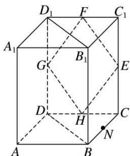

<!-- question-source:start -->
11. 如图所示，在正四棱柱 $ABCD—A_1B_1C_1D_1$ 中， $E, F, G, H$ 分别是棱 $CC_1, C_1D_1, D_1D, DC$ 的中点， $N$ 是 $BC$ 的中点，点 $M$ 在四边形 $EFGH$ 及其内部运动，则 $M$ 只需满足条件 \_\_\_\_ 时，就有 $MN//$ 平面 $B_1BDD_1$ . (注：请填上你认为正确的一个条件即可，不必考虑全部可能情况)

<!-- question-source:end -->

![[高中/总复习/专题/立体几何/专题03 立体几何中空间线、面位置关系的判定(2)-立体几何（文理通用）/专题03_立体几何中空间线_面位置关系的判定_2__立体几何_文理通用_/对点训练/answers/Q00039546A1.md]]
