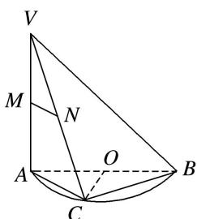

<!-- question-source:start -->
17. 如图所示, $AB$ 是半圆 $O$ 的直径, $VA$ 垂直于半圆 $O$ 所在的平面, 点 $C$ 是圆周上不同于 $A$ , $B$ 的任意一点, $M$ , $N$ 分别为 $VA$ , $VC$ 的中点, 则下列结论正确的是( )

A. $MN \parallel AB$ B. 平面 $VAC \perp$ 平面 $VBC$ C. $MN$ 与 $BC$ 所成的角为 $45^{\circ}$ D. $OC \perp$ 平面 $VAC$
<!-- question-source:end -->

![[高中/总复习/专题/立体几何/专题03 立体几何中空间线、面位置关系的判定(2)-立体几何（文理通用）/专题03_立体几何中空间线_面位置关系的判定_2__立体几何_文理通用_/对点训练/answers/Q00039552A1.md]]
